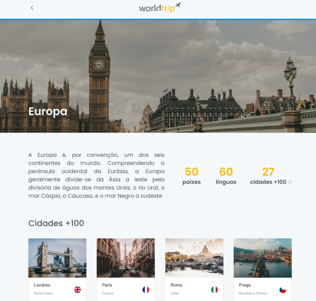

<h1 align="center">
  Challenge 06 - Interface with Chakra UI
</h1>

  

 

  

 

## 💻 About the challenge

In this challenge I had two main objectives: First, develop all the interface from a Figma layout with Chakra UI. The second one, make the whole application responsive for mobile. I also used JSON Server and created a fake API so the data could be dynamic, and Swiper Lib to create the carousel.

 

## 🖱 Technologies

- ReactJS
- NextJS
- TypeScript
- Chakra UI
- JSON Server
- Axios
- Swiper
